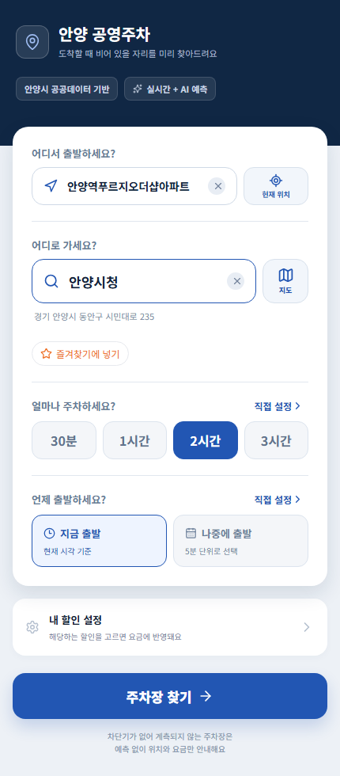
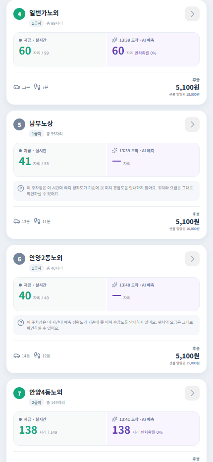
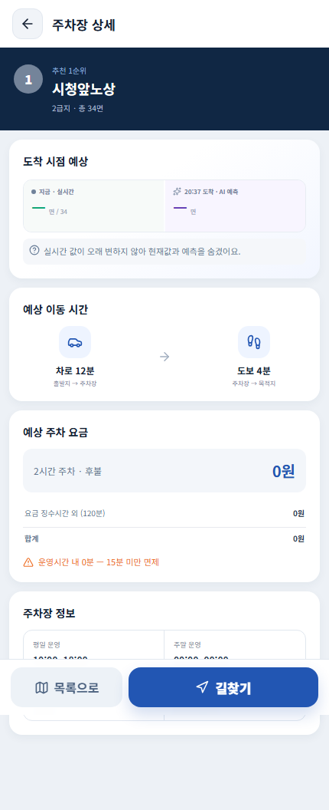

# 2026년 안양시 공공데이터 AI 활용 대학생 경진대회 제품 및 서비스 개발 사업계획서

| 구분 | 내용 |
|---|---|
| 팀명 | 야도란 |
| 제품 서비스명 | 파킹안양 |
| 참가자 | 김태영, 차준혁 |
| 역할 | 김태영: 주차장 조사, 웹 화면, 사업계획서 / 차준혁: 데이터 수집, 백엔드, 예측 모델 |
| 공개 데모 | http://35.229.35.13/ |

# 1. 제안 배경 및 출품작 소개

## 도착할 때의 혼잡도와 실제 이용요금을 함께 비교하는 주차장 추천

석수역 근처에 가는 운전자가 출발 전에 가장 가까운 공영주차장을 골랐다고 가정해 보았다. 출발할 때는 여유가 있었지만 20분 뒤 도착했을 때 혼잡해졌다면, 운전자는 다시 다른 주차장을 찾아야 한다. 이 장면은 문제를 설명하기 위한 가상 사례지만, 현재 주차정보와 운전자가 도착할 때의 상황이 다르다는 문제는 실제 서비스에서도 남아 있다.

요금도 단순하지 않았다. 안양 공영주차장은 주차장과 급지에 따라 요금이 다르고, 이용시간이 길어질수록 누진 구간이 달라진다. 요금징수 시간을 벗어난 구간은 무료인 곳도 있으며 시간제 요금과 선불 일일권 중 어느 쪽이 유리한지도 체류시간에 따라 달라진다. 여기에 요금징수 시간이 끝난 뒤에도 차량이 드나들 수 있는 곳과, 특정 시각 이후 출차가 제한되는 곳이 함께 존재한다.

처음에는 안양 주차포털에 표시되는 89곳을 같은 방식으로 예측하면 될 것으로 생각했다. 그러나 2026년 8월 31일부터 5분 간격으로 값을 모아 보니 21곳은 수집 기간 동안 점유 값이 사실상 움직이지 않았다. 나머지 68곳에서도 주차장과 시간대에 따라 값의 신뢰도가 달랐다. 이에 따라 고정된 21곳은 예측 순위에서 분리하고, 값이 실제로 움직이는 시설과 시간대만 예측에 사용했다. 출입 규칙은 웹·문서·사용 경험을 통해 확인했으며, 현재 서비스에는 활성 시설 68곳 중 63곳의 규칙이 적재되어 있다. 나머지 5곳은 확인 전 정보로 구분한다.

파킹안양은 목적지와 주차시간을 입력받아 다음 세 가지를 한 화면에서 비교한다.

- 차량 도착 시점의 예상 혼잡도
- 실제 주차 구간 중 유료시간을 반영한 예상요금
- 주차장에서 목적지까지의 도보시간

추천은 하나의 종합점수로 숨기지 않고 최저요금순과 도보 최단순을 따로 제공한다. 두 목록에서 도착 시점에 혼잡할 확률이 높은 후보는 뒤로 이동시키고 이유를 함께 표시한다. 확인된 출입 제한시간과 예상 출차시각이 충돌하는 후보는 추천에서 제외한다. 데이터가 오래됐거나 검증 기준을 통과하지 못한 경우에는 AI 값을 억지로 표시하지 않고 현재 정보와 요금·거리만 제공한다.

**이용 흐름**

목적지·출발지 입력 → 주차시간 선택 → 주변 후보 탐색 → 차량 도착시각과 예상 출차시각 계산 → 출입 불가 후보 제외 → 혼잡도·요금·도보시간 계산 → 요금순·도보순 비교 → 길찾기

이 서비스는 주차를 보장하는 예약 서비스가 아니다. 대신 예약이 어려운 안양 공영주차장에서 운전자가 출발 전에 더 많은 조건을 비교하도록 돕는 시민용 의사결정 서비스다. 주차 탐색시간이나 탄소배출 감소 효과는 실제 이용자 실증 이후 측정한다.

# 2. AI 학습 분석 도구 활용 및 AI 기술 적용 세부 내용

## 2.1 예측 대상과 데이터

예측 목표는 현재 점유 상태를 그대로 보여주는 것이 아니라 차량이 도착할 미래 시점의 점유율과 혼잡 위험을 추정하는 것이다. 혼잡은 점유율 90% 이상으로 정의했다. 이는 빈자리가 정확히 0면이라는 뜻이나 실제 주차 실패 확률과는 다르다.

안양 주차포털의 `PARK_COUNT`를 5분 간격으로 수집해 시계열을 만들었다. `PARK_COUNT`는 잔여면수가 아니라 현재 주차 대수이며, 점유율은 이를 전체 주차면 수인 `CELL_CNT`로 나누어 계산한다. 주요 재평가에는 2026년 8월 31일부터 9월 19일까지 수집한 약 48만 6천 행을 사용했다.

모델 입력은 28개 특징으로 구성했다.

| 구분 | 주요 입력 | 판단하려는 내용 |
|---|---|---|
| 최근 변화 | 현재 점유율, 5·10·15·30·60분 전 값, 변화량, 이동평균 | 지금 차오르는지 빠지는지 |
| 시간 | 시각, 요일, 주말 여부, 주기 변환값 | 반복되는 시간대 패턴 |
| 시설 | 주차장 식별자, 주차장과 주말의 상호작용 | 시설마다 다른 움직임 |
| 운영 | 운영 상태, 개장·마감까지 남은 시간 | 마감 전후의 변화 |

점유율은 LightGBM 분위 회귀 모델로 예측하고, 점유율 90% 이상이 될 확률은 별도의 LightGBM 분류 모델과 확률 보정 과정으로 계산한다. 두 결과를 하나의 모델이 동시에 출력한다고 표현하지 않았다. Python, pandas, NumPy, scikit-learn, LightGBM과 SQLite를 사용했으며, 생성형 AI는 서비스의 주차 예측 모델로 사용하지 않았다.

## 2.2 시간 순서를 지킨 평가

미래 데이터를 학습에 섞지 않기 위해 날짜 순서대로 학습·검증·평가 구간을 나누는 시간순 이동검증을 적용했다. 값이 고정되거나 예측 가능한 시간 밖에 있는 관측은 입력과 정답에서 제외했다. 비교 기준은 세 가지 중 같은 평가행에서 가장 정확했던 ‘현재값 유지’ 방식으로 정했다. 이 방식은 현재 점유율이 도착 시점까지 그대로 이어진다고 가정한다.

2026년 9월 12일부터 18일까지 7일을 평가했을 때 AI 모델은 15·30·60·120분에서 현재값 유지보다 오차가 낮았다. 시설별로 유효한 평가행 수가 다르므로 68곳 모두가 모든 표의 행에 포함된 것은 아니다.

| 예측시간 | 구분 | 현재값 유지 MAE | AI MAE | 오차 감소 |
|---:|---|---:|---:|---:|
| 15분 | 평일 | 2.74%p | 2.66%p | 3.2% |
| 15분 | 주말 | 1.79%p | 1.70%p | 4.6% |
| 30분 | 평일 | 4.21%p | 3.76%p | 10.6% |
| 30분 | 주말 | 2.92%p | 2.61%p | 10.4% |
| 60분 | 평일 | 6.51%p | 5.03%p | 22.7% |
| 60분 | 주말 | 4.87%p | 4.00%p | 17.8% |
| 120분 | 평일 | 10.03%p | 6.35%p | 36.7% |
| 120분 | 주말 | 7.88%p | 5.67%p | 28.0% |

지표는 점유율 평균절대오차이며, 조합별 평가행은 12,497~51,501건이다. 평일 5일과 주말 2일을 포함했다. 예측시간이 길어질수록 현재 상태가 그대로 이어진다는 가정이 약해져 AI의 개선 폭이 커졌다.

## 2.3 AI가 실제 추천을 바꾸는지 검증

점유율 예측값만 바꾸면 후보 간 원래 점유율 차이가 더 커서 순위가 거의 바뀌지 않을 수 있다. 그러나 서비스에서 AI가 맡는 핵심 역할은 예측 점유율만으로 재정렬하는 것이 아니라 도착 시 혼잡할 확률이 높은 후보를 뒤로 보내는 것이다. 따라서 다음 세 방식을 비교했다.

- A: 혼잡 강등 없이 요금순 또는 도보순으로 정렬
- B: AI가 계산한 혼잡확률이 0.5를 넘는 후보를 뒤로 이동
- C: 현재 점유율이 이미 90% 이상인 후보만 뒤로 이동

15·30·60·120분 조건의 유효 질의 2,875건을 비교한 결과는 다음과 같다.

| 추천 기준 | A의 1위가 도착 시 고혼잡 | B 적용 후 남은 고혼잡 | B가 뒤로 보낸 고혼잡 | C가 뒤로 보낸 고혼잡 | AI의 추가 기여 |
|---|---:|---:|---:|---:|---:|
| 요금순 | 557건 | 36건 | 521건 | 493건 | 28건 |
| 도보순 | 607건 | 38건 | 569건 | 541건 | 28건 |

같은 실험에서 전체 순위가 달라진 비율은 요금순 28.0%, 도보순 29.8%였고, 1위가 달라진 비율은 각각 19.7%, 22.6%였다. 즉 AI를 적용해도 추천이 거의 바뀌지 않는다는 기존 측정은 서비스의 실제 강등 로직을 반영하지 못한 결과였다.

다만 이 수치를 ‘헛걸음을 방지한 비율’로 부르지는 않는다. 표의 사건은 도착 시 실제 점유율이 90% 이상이었던 경우이며, 실제 사용자가 입구에서 주차에 실패한 사건이 아니다. 또한 C만으로도 상당수를 걸러냈으므로 AI의 고유 기여는 B 전체가 아니라 C보다 추가로 줄인 28건이다. 혼잡확률 기준 0.5도 같은 평가자료를 참고해 선택했으므로 새로운 기간에서 재검증해야 한다.

## 2.4 검증되지 않은 예측은 숨긴다

서비스는 주차장과 예측시간 조합마다 노출 여부를 다르게 판단한다. 내부 서비스 노출 게이트 548개 조합 중 181개가 기준을 통과했으며, 나머지는 표본 부족, 현재값 기준 미달, 전·후반 재현 실패 또는 장기 예측 차단 등의 이유로 AI 값을 표시하지 않는다. 이 평가는 같은 7일 자료를 앞뒤로 나눈 내부 검증이므로 외부 인증이나 독립 기간 검증으로 표현하지 않는다.

15·30·60·120분을 핵심 제공 범위로 두고, 240분 이상 장기 예측은 재현성이 부족해 차단한다. p10~p90 예측구간 역시 기존 커버리지 평가가 부분 통과에 그쳐 현재 화면에는 표시하지 않는다. 실제 이용자 현장 실증과 계절 변화 검증도 아직 남아 있다.

# 3. 출품작 핵심내용

## 3.1 활용 데이터와 출처

공공데이터, 안양 주차포털의 실시간 조회정보, 자치법규, 자체 조사, 상용 경로 API를 목적에 맞게 구분해 사용했다.

| 제공 기관 또는 플랫폼 | 정확한 데이터명 | 공식 상세 URL |
|---|---|---|
| 지방자치단체·공공데이터포털 | 전국주차장정보표준데이터 | https://www.data.go.kr/data/15012896/openapi.do |
| 한국교통안전공단·공공데이터포털 | 한국교통안전공단 주차정보 제공 API | https://www.data.go.kr/data/15099883/openapi.do |
| 안양도시공사 | 안양시 통합주차포털 실시간 주차정보 | https://parking.auc.or.kr/main |
| 경기도 안양시·국가법령정보센터 | 안양시 주차장 설치 및 관리 조례 제3832호 | https://law.go.kr/LSW/ordinInfoP.do?ordinSeq=2102223 |
| 카카오모빌리티 | 카카오 로컬 및 자동차 길찾기 API | https://developers.kakao.com/docs/latest/ko/local/common |
| 티맵모빌리티 | TMAP 보행자 경로안내 API | https://tmapapi.tmapmobility.com/main.html#webservice/docs/tmapRoutePedestrianDoc |

전국주차장정보표준데이터는 주차장명, 위치, 유형, 주차면 수, 운영·요금 정보를 보완하고 실시간 관측이 없는 주변 시설을 별도로 표시하는 데 사용했다. 한국교통안전공단 API는 시설 식별자와 좌표를 대조하고 외부 특징 실험에 사용했다. 두 자료를 안양 실시간 예측의 정답으로 사용하지는 않았다.

예측의 주 자료는 안양 통합주차포털에서 조회되는 현재 주차 대수와 전체 면수다. 해당 조회 경로는 공공데이터포털에 등록된 데이터셋과 구분해 적었으며, 원자료를 별도로 공개·재배포하지 않는다. 조례의 별표 1·2·5는 누진요금, 감면, 일일권 계산의 근거로 사용했다. 카카오 API는 장소 검색과 차량 도착시간, TMAP API는 주차장부터 목적지까지의 보행시간 계산에 사용하며 실패 시 추정값임을 표시한다.

## 3.2 서로 다른 세 가지 시간을 분리

수집을 시작한 뒤 가장 먼저 바로잡은 것은 ‘운영시간’이라는 한 단어로 모든 판단을 처리하지 않는 것이었다.

| 구분 | 뜻 | 서비스에서 쓰는 곳 |
|---|---|---|
| 출입 가능시간 | 차량이 실제로 들어오고 나갈 수 있는 시간 | 예상 입·출차가 제한시간을 넘으면 후보 제외 |
| 요금징수 시간 | 실제로 요금이 붙는 시간 | 유료분과 무료분을 나누어 금액 계산 |
| 예측 가능시간 | 실시간 값의 움직임을 신뢰할 수 있는 시간 | 모델 학습·평가·화면 노출 제한 |

예를 들어 평일 09시부터 17시까지만 요금을 받고 이후에는 무료 개방하는 곳에 16시부터 4시간 주차하면 유료시간은 1시간만 계산한다. 반면 18시에 출차문을 닫는 곳에 16시부터 4시간 주차하려는 경우에는 싸게 계산하는 것이 아니라 추천 대상에서 제외한다. 실시간 값이 운영시간 밖에서 고정되는 곳은 출입 가능 여부와 별개로 AI 예측만 숨긴다.

서비스용 조사표는 주차장·평일·토요일·일요일/공휴일 단위로 267행이다. 이 가운데 검증된 189행, 63곳의 규칙을 서비스에 적재했고 78행은 근거가 부족해 사용하지 않았다. 활성 주차장 중 규칙이 확인되지 않은 5곳은 확정된 운영규칙처럼 안내하지 않는다. 장기간 값이 움직이지 않은 21곳은 위치·요금 정보는 제공할 수 있지만 실시간 예측 순위에서는 분리한다.

## 3.3 데이터 품질을 추천 조건으로 사용

값이 존재한다고 해서 정상 데이터라고 보지 않았다. 주차장별 변화 범위, 관측 지연시간, 요일·시간대별 경직 여부를 확인해 다음과 같이 처리했다.

- 전 기간의 점유 변화가 사실상 없는 시설은 고정 피드로 분류
- 특정 시간대에 값이 멈추는 시설은 해당 시간의 예측을 제한
- 최신 관측이 늦은 경우 실시간 또는 AI 표시를 숨기고 이유를 안내
- 같은 시설이라도 예측시간별 정확도 기준을 통과한 조합만 노출

경직 구간이 운영시간과 비슷하더라도 원인을 단정하지 않았다. 실제 출입이 없는 것인지, 센서나 제공 시스템이 갱신을 멈춘 것인지 원자료만으로 구별할 수 없기 때문이다.

## 3.4 체류시간을 반영한 요금 계산

요금 계산기는 급지와 주차장 유형에 따른 누진 구간, 요금징수 시간 밖의 무료 구간, 15분 미만 면제, 일 최대상한, 100원 미만 절사를 반영한다. 시간제 후불요금과 선불 일일권은 구매조건이 다른 상품이므로 각각 표시하고 더 저렴한 선택지를 안내하되, 일일권 구매 가능 여부를 보장하지 않는다.

사용자가 경차·저공해차·다자녀 등 여러 감면 자격을 선택하면 각 자격을 따로 계산해 가장 유리한 한 가지를 보여준다. 조례에서 중복 적용 여부가 확인되지 않은 감면율을 임의로 곱하지 않으며, 현장 증빙이 필요하다는 점을 함께 안내한다. 자정을 넘기는 다일 이용과 일일권 재구매 조건은 확인 전에는 확정 금액으로 제공하지 않는다.

# 4. 기존 서비스와의 독창성

실시간 주차정보, 가격 비교, 결제, 도착 시점 만차 예측은 이미 다른 서비스에도 존재한다. 특히 카카오모빌리티는 주차장 입출차 데이터와 도착 예상시간을 이용해 만차를 예측하고 대안 주차장을 안내한다고 공식적으로 설명한다. 따라서 파킹안양은 ‘국내 최초 AI 주차 예측’이나 ‘유일한 도착 시점 예측’을 주장하지 않는다.

공개된 공식 자료를 2026년 9월 20일 기준으로 비교했다. `미확인`은 기능이 없다는 뜻이 아니라 공식 공개자료에서 확인하지 못했다는 뜻이다.

| 사용자 질문 | 안양 통합주차포털 | 카카오 T 주차 | 아이파킹 | 파킹안양 |
|---|---|---|---|---|
| 현재 주차정보를 볼 수 있는가 | 확인 | 일부 확인 | 확인 | 데이터 상태에 따라 제공 |
| 도착 시점 혼잡을 판단하는가 | 미확인 | 확인 | 미확인 | 검증된 조합만 제공 |
| 혼잡하면 대안을 바꾸는가 | 미확인 | 확인 | 미확인 | AI 혼잡확률로 후순위 이동 |
| 입력한 체류구간의 예상요금을 계산하는가 | 입차 후 조회 확인 | 미확인 | 주차권 가격 비교 확인 | 유료·무료 구간을 나눠 계산 |
| 예상 출차시각까지 출입 가능한가 | 미확인 | 미확인 | 미확인 | 확인된 규칙 범위에서 검사 |
| 예약·결제를 제공하는가 | 확인 | 확인 | 확인 | 미제공 |

파킹안양의 차이는 AI 모델 하나에 있지 않다. 목적지와 체류시간을 먼저 받은 뒤 도착 시점 혼잡, 실제 출입 가능시간, 유료시간을 반영한 요금, 목적지까지의 도보시간을 같은 추천 과정에서 판단하는 데 있다. 안양 공영주차장에 범위를 좁혀 지역 규칙을 자세히 반영했고, 근거가 부족한 시설과 시간에는 예측을 숨긴다.

반대로 예약·결제, 민영주차장 제휴 규모, 기존 이용자 기반에서는 대형 플랫폼이 분명히 앞선다. 예약 가능한 주차면이 있다면 예약이 더 확실한 선택일 수 있다. 파킹안양은 예약 상품이 충분하지 않은 공영주차장에서 출발 전 선택을 돕는 보완 서비스로 자리매김한다.

지도와 카드 화면은 다른 팀도 구현할 수 있다. 시간이 필요한 자산은 5분 간격으로 쌓은 연속 관측, 시설별 데이터 경직 진단, 출입·과금 규칙의 근거 기록, 시간 순서를 지킨 평가와 노출 이력이다. 이 자료가 계속 갱신될수록 추천의 범위와 신뢰도를 함께 넓힐 수 있다.

# 5. 출품작의 완성도

파킹안양은 웹 화면, 추천 API, 요금 계산기, 경로 API, 예측 모델이 연결된 상태로 GCP에 배포되어 있다. 2026년 9월 20일 공개 서버 상태 점검에서 모델 준비, 최신 관측 수신, 활성 피드 68곳, 고정 피드 21곳, 출입 규칙 63곳 적재를 확인했다. 공개 데모에서는 비회원 추천을 우선 제공하며 카카오 로그인은 활성화하지 않았다.

| 핵심 기능 | 구현 상태 | 실제 데이터 연결 | 검증 근거 | 남은 과제 |
|---|---|---|---|---|
| 현재 주차 대수 표시 | 구현 | 5분 주기 관측, 활성 68곳 | 최신 관측시각과 지연시간 상태 점검 | 고정 피드 21곳은 실시간 미제공 표시 |
| 도착 시점 점유 예측 | 구현 | 모델과 서비스 노출 게이트 연결 | 7일 시간순 평가, 내부 게이트 181/548 통과 | 독립 기간 재검증, 장기 예측 차단 유지 |
| 혼잡확률 기반 강등 | 구현 | 요금순·도보순에 적용 | A/B/C 추천 실험 | 새로운 기간과 실제 이용자로 재검증 |
| 출입 제한 후보 제외 | 구현 | 확인된 63곳 규칙 적재 | CSV 스키마 검증과 추천 제외 테스트 | 활성 5곳 추가 확인 |
| 체류시간별 요금 | 구현 | 조례 요금표와 조사 과금시간 연결 | 누진·무료시간·상한·일일권 내역 제공 | 최신 조례 별표 재대조, 다일 이용 보강 |
| 할인 설정 | 구현 | 자격 코드만 받아 개별 견적 비교 | 감면별 요금 계산 | 회원 저장과 중복 감면 정책 확인 |
| 차량·도보시간 | 구현 | 카카오 자동차 경로, TMAP 보행 경로 | 응답 출처와 캐시 상태 표시 | API 실패 시 추정값 정확도 개선 |
| 카카오 로그인·마이페이지 | 코드 구조만 구현 | 공개 데모 비활성 | 서버 상태에서 비활성 확인 | 운영환경·개인정보 정책 확정 후 도입 |

main 브랜치에 변경사항이 반영되면 서비스 코드 컴파일, 웹 빌드, 추천·출입·강등·게이트 회귀시험을 거쳐 배포하도록 자동화했다. 배포 뒤 상태 점검에 실패하면 이전 버전으로 되돌리는 절차도 구성했다. 검증 실행 건수를 근거 없이 합산하지 않고, 최종 제출 시 공개 가능한 CI 실행 링크로 제시한다.

## 실제 화면

**그림 1. 검색 화면** — 출발지 안양시청, 목적지 안양역, 주차시간 2시간과 출발시각을 입력한다. 로그인하지 않아도 이용할 수 있고, 할인 설정은 개인정보 대신 감면 항목 코드만 사용한다.

**그림 2. 추천 결과** — 안양역 주변 후보를 지도와 카드로 보여준다. 현재 주차 대수와 도착 시점 예측을 구분하고, 예측할 수 없는 후보에는 숫자 대신 이유를 표시한다. 요금순과 도보순을 따로 선택할 수 있다.

**그림 3. 무료시간대 요금 상세** — 남부노상의 이용구간이 요금징수 시간 밖에 있어 후불 예상요금이 0원으로 계산된 사례다. 혼잡 예측을 제공할 수 없는 경우에도 경로와 요금정보는 분리해 제공한다.

현재 제공하지 않는 기능도 명확하다. 파킹안양은 주차면을 예약하거나 실제 이용 가능성을 보장하지 않는다. p10~p90 예측구간과 240분 이상 장기 예측은 검증이 부족해 노출하지 않는다. 실제 이용자 대상 현장 실증과 기관 협력도 아직 진행하지 않았다.

# 6. 출품작의 발전 가능성

기능 수를 늘리는 것보다 현재 추천이 실제 현장에서 맞는지 확인하는 일을 먼저 한다. 이후 예측 신뢰성과 요금·출입 규칙을 보강하고, 편의 기능과 지역 확장은 그 다음에 진행한다.

| 단계 | 작업 | 담당 | 완료 기준 | 비용 또는 위험 |
|---|---|---|---|---|
| 제출 직후 | 활성 5곳 출입 규칙 추가 확인, 최신 조례 별표와 요금표 재대조 | 조사·백엔드 | 활성 68곳의 상태와 근거가 모두 기록됨 | 전화·방문 조사 시간 |
| 1~3개월 | 새 기간과 추가 주말 데이터로 예측·강등 재검증 | 모델 | 현재값 기준 대비 AI 추가 효과가 독립 기간에서도 재현됨 | 재현 실패 시 노출 범위 유지 또는 축소 |
| 1~3개월 | 실제 운전자 소규모 사용성 시험 | 팀 전체 | 추천 선택, 실제 도착 혼잡, 입출차 가능 여부, 정산금액 기록 | 참여자 모집과 개인정보 관리 |
| 1~3개월 | 조사정보 갱신·오류 제보 절차 마련 | 조사·백엔드 | 제보와 확정 규칙을 분리하고 변경 이력을 보존 | 잘못된 제보의 자동 반영 위험 |
| 3~6개월 | 감면 설정과 선택적 로그인 | 웹·백엔드 | 자격별 예상요금 일치, 동의·삭제·보관 정책 확정 | 민감정보 수집 범위 증가 |
| 3~6개월 | 안양시·운영기관 협력 실증 | 팀 전체 | 데이터 이용조건과 현장 검증방법 합의 | 협의 불발 가능 |
| 이후 | 조건을 충족하는 인접 지자체로 확대 | 팀 전체 | 안정적 실시간 관측, 시설 ID, 요금·출입 규칙, 현지 재검증 확보 | 지역별 조례와 데이터 품질 차이 |

성과는 다음과 같이 측정한다.

| 성과지표 | 측정방법 |
|---|---|
| AI의 추가 혼잡 감소 효과 | 현재 점유율 강등 C와 AI 강등 B의 도착 시 고혼잡 1위 비율 차이 |
| 실제 이용 가능 여부 | 추천 시각·도착시각·출차시각과 현장 이용 결과 대조 |
| 예상요금 일치율 | 서비스 견적과 실제 정산 영수증 비교 |
| 규칙 확인률 | 활성 주차장 중 근거가 있는 출입·과금 규칙 비율 |
| 데이터 최신성 | 최신 관측과 현재시각의 차이, 경직 시설 수 |
| 서비스 응답시간 | 추천 요청부터 결과 표시까지 걸린 시간 |

운영비는 서버·DB 저장비, 길찾기 API 호출비, 데이터 수집과 조사 갱신 인력으로 구성된다. 이용자 수가 정해지지 않은 상태에서 임의의 매출이나 절감액을 만들지 않고, 실제 사용량을 확보한 뒤 다음 식으로 계산한다.

> 월 운영비 = 서버·저장 고정비 + 월 추천 요청 수 × 요청당 외부 API 비용 + 조사·운영 인건비

시민에게 기대하는 효과는 혼잡한 후보를 선택하는 경우를 줄이고, 주차 전 요금 비교와 출차 가능 여부 확인을 쉽게 만드는 것이다. 행정 측면에서는 실시간 데이터가 실제 시민의 선택에 어떻게 쓰이는지 확인하고 시설별 데이터 품질 문제를 발견하는 데 활용할 수 있다. 탐색시간, 교통량, 탄소배출 감소는 현장 실증 전에는 수치로 제시하지 않는다.

서비스는 로그인 없이 이용 가능하다. 회원별 이동 이력은 만들지 않지만, 장소 검색과 경로 계산에 사용되는 검색어·좌표 키는 성능을 위한 캐시에 저장될 수 있다. 운영 전 캐시 보관기간과 삭제정책을 공개한다. 감면 기능은 장애 여부 같은 상세 증명정보를 저장하지 않고 사용자가 선택한 감면 항목 코드만 계산에 사용하도록 설계한다.

# 7. 기타 참고 자료

| 자료 | 입증하는 내용 | 확인 경로 |
|---|---|---|
| 파킹안양 공개 데모 | 검색부터 추천·요금·길찾기까지의 전체 흐름 | http://35.229.35.13/ |
| 서비스 상태 API | 모델, 데이터 최신성, 활성·고정 피드, 출입 규칙 적재 상태 | http://35.229.35.13/api/v1/health |
| 안양시 통합주차포털 | 실시간 주차정보와 주차요금·선불권 원천 안내 | https://parking.auc.or.kr/main |
| 전국주차장정보표준데이터 | 시설 위치·유형·면수·운영정보 | https://www.data.go.kr/data/15012896/openapi.do |
| 안양시 주차장 설치 및 관리 조례 | 누진요금·감면·일일권 계산 근거 | https://law.go.kr/LSW/ordinInfoP.do?ordinSeq=2102223 |
| 카카오모빌리티 기술 소개 | 도착시점 만차 예측 선행 서비스 확인 | https://www.kakaomobility.com/technology |

예측 성능표, A/B/C 강등 비교표, 데이터 품질 진단표는 본문에 평가기간·분모·사건 정의와 함께 제시했다. API 키, 개인 연락처, 재배포가 제한된 원자료는 제출물에 포함하지 않는다.

---

# 편집용 제출 전 확인 목록

아래 내용은 최종 제출본에서 삭제한다.

- [ ] 서비스명 `파킹안양`과 화면 상단의 `안양 공영주차` 표기를 하나로 통일
- [ ] 공개 데모에 HTTPS 또는 짧은 접속주소를 적용하고 QR 코드 생성
- [ ] 최신 조례 제3832호의 별표 1·2·5와 코드의 요금 상수를 마지막으로 대조
- [ ] 활성 주차장 중 출입 규칙 미확인 5곳을 확정하거나 화면에서 미확인 표시 재검증
- [ ] 요금 상세 화면의 소수점 분 표시를 정수 분으로 수정한 뒤 캡처 교체
- [ ] 추천 결과 전체 화면은 핵심 카드 2~3개가 보이도록 잘라 본문 가독성 확보
- [ ] 공개 가능한 CI 실행 링크와 소스 저장소 링크가 있으면 7번에 추가
- [ ] 공식 양식에 옮긴 뒤 표·그림 포함 10페이지 이내인지 PDF 렌더링으로 확인
- [ ] 팀원 이름·역할·서비스 URL·작성일 최종 확인
